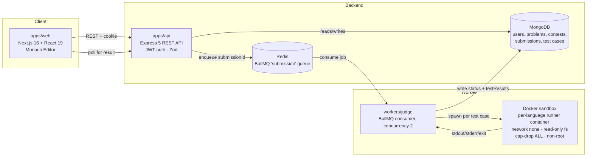

<p align="center">
  
</p>

<h1 align="center">Coding Platform</h1>

<p align="center">
  An online judge and contest platform: write code in the browser, submit it, and get it compiled,
  sandboxed, and graded against test cases in real time.
</p>

<p align="center">
  
  
  
  
  
  
  
  
  
  
</p>

## Table of contents

- [What this is](#what-this-is)
- [Features](#features)
- [Architecture](#architecture)
- [Tech stack](#tech-stack)
- [API reference](#api-reference)
- [Data model](#data-model)
- [The judge: languages, runners & sandbox](#the-judge-languages-runners--sandbox)
- [Scoring & leaderboard](#scoring--leaderboard)
- [UI screens](#ui-screens)
- [Getting started](#getting-started)
- [Project structure](#project-structure)
- [System design notes (interview prep)](#system-design-notes-interview-prep)
- [Known limitations](#known-limitations)
- [Logo](#logo)
- [License](#license)

## What this is

A monorepo for a LeetCode/Codeforces-style coding platform, split into an API, a background judge
worker, a web client, and a shared package:

| Workspace                 | Path            | Role                                                                       |
| -------------------------- | ---------------- | ---------------------------------------------------------------------------- |
| `api`                      | `apps/api`       | Express REST API — auth, problems, contests, submissions, test cases         |
| `web`                      | `apps/web`       | Next.js client — problem browser, Monaco code editor, contests, admin        |
| `judge-worker`             | `workers/judge`  | BullMQ worker that compiles/runs submissions in a sandbox and grades them    |
| `@coding-platform/shared`  | `packages/shared` | Shared TypeScript types and constants used across the other workspaces      |

## Features

- **Auth & profiles** — JWT (httpOnly cookie) login/register, per-user stats and solved-problem badges.
- **Problems** — CRUD problem management with per-language starter code, examples, constraints, tags, difficulty, and both sample and hidden test cases.
- **Submissions** — submit code in 5 languages, queued and judged asynchronously, with live status polling and per-test-case results.
- **Judging sandbox** — per-submission Docker execution with dedicated runners for C, C++, Java, JavaScript, and Python; output comparison and result classification (`ACCEPTED` / `WRONG_ANSWER` / `TIME_LIMIT` / `MEMORY_LIMIT` / `RUNTIME_ERROR` / `COMPILE_ERROR` / `SYSTEM_ERROR`), bounded by configurable time, memory, output, and process limits.
- **Run vs. Submit** — "Run" only executes visible sample tests for fast iteration; "Submit" runs the full hidden suite and is the only mode that counts toward solved stats.
- **Contests** — create/manage contests, register, per-contest problem sets, ICPC-style live leaderboard with penalty-time scoring.
- **Admin** — manage problems, users, submissions, and contests from a dedicated admin area, gated by role-based middleware.
- **Code editor** — Monaco-based in-browser editor with language selection and structured result feedback.

## Architecture



The API enqueues each submission onto a Redis-backed BullMQ queue (`submission`); the judge worker
consumes the queue, runs the submitted code inside a sandboxed Docker container using a per-language
runner, compares stdout against the problem's test cases one at a time (stopping at the first
failure), writes the graded result back to MongoDB, and (on an accepted `SUBMIT`) updates the user's
aggregate stats — all of which the web client polls and displays.

## Tech stack

- **API**: Node.js, Express 5, Mongoose (MongoDB), BullMQ + ioredis, JWT auth (httpOnly cookie via `cookie-parser`), Zod validation, bcrypt/bcryptjs password hashing
- **Worker**: Node.js, BullMQ consumer, Docker CLI (`docker run`) as the execution sandbox, Mongoose
- **Web**: Next.js 16 (App Router), React 19, Tailwind CSS 4, `@monaco-editor/react`
- **Shared**: TypeScript project (`@coding-platform/shared`) — types and constants (languages, terminal submission statuses) shared across all three runtimes
- **Tooling**: npm workspaces monorepo, `tsx` for dev-mode TS execution, `concurrently` to run all three services with one command

## API reference

Base path: `/api`. Auth is a JWT stored in an httpOnly cookie (`token`), attached automatically by
the browser; `optionalAuthenticate` populates `req.user` when present without rejecting anonymous
requests.

### Auth — `/api/auth`

| Method | Path       | Auth | Description                          |
| ------ | ---------- | ---- | -------------------------------------- |
| POST   | `/register` | —    | Create an account                     |
| POST   | `/login`    | —    | Log in, sets the `token` cookie        |
| POST   | `/logout`   | —    | Clear the auth cookie                  |
| GET    | `/me`       | user | Current user from the verified token   |

### Users — `/api/users`

| Method | Path | Auth  | Description                          |
| ------ | ---- | ----- | --------------------------------------|
| GET    | `/me` | user  | Current user's profile + stats        |
| GET    | `/`   | admin | List all users                        |

### Problems — `/api/problems`

| Method | Path         | Auth  | Description                                              |
| ------ | ------------ | ----- | ------------------------------------------------------------ |
| GET    | `/`           | —     | List published problems (public browse)                     |
| GET    | `/:slug`      | —     | Get one problem by slug                                      |
| POST   | `/`           | admin | Create a problem                                              |
| PATCH  | `/:slug`      | admin | Update a problem                                              |
| DELETE | `/:slug`      | admin | Delete a problem                                              |
| GET    | `/admin/all`  | admin | List all problems including drafts/archived, for the admin table |

### Test cases — `/api/test-cases`

| Method | Path                  | Auth  | Description                          |
| ------ | --------------------- | ----- | ---------------------------------------|
| POST   | `/problem/:problemId`  | admin | Add a test case to a problem           |
| GET    | `/problem/:problemId`  | admin | List a problem's test cases            |
| PATCH  | `/:id`                 | admin | Update a test case                     |
| DELETE | `/:id`                 | admin | Delete a test case                     |

### Submissions — `/api/submissions`

| Method | Path        | Auth  | Description                                                    |
| ------ | ----------- | ----- | ------------------------------------------------------------------ |
| POST   | `/`          | user  | Submit code (`mode: RUN \| SUBMIT`) — enqueues a judge job          |
| GET    | `/`          | user  | List the current user's submissions                                |
| GET    | `/:id`       | user  | Get one submission (status + per-test-case results)                |
| GET    | `/admin/all` | admin | List every submission, for the admin table                         |

### Contests — `/api/contests`

Any authenticated user can create a contest (not admin-only); ownership (creator or admin) is
enforced inside the service for mutations, not at the route level.

| Method | Path                                                     | Auth      | Description                                             |
| ------ | ---------------------------------------------------------- | --------- | ----------------------------------------------------------- |
| POST   | `/`                                                          | user      | Create a contest                                             |
| GET    | `/`                                                          | —         | List published contests                                      |
| GET    | `/:slug`                                                     | optional  | Contest detail (personalized if logged in)                   |
| PATCH  | `/:slug`                                                     | owner/admin | Update a contest                                            |
| DELETE | `/:slug`                                                     | owner/admin | Delete a contest                                            |
| POST   | `/:slug/register`                                            | user      | Register the current user for a contest                      |
| GET    | `/:slug/problems/:problemSlug`                               | user      | Solve view — gated by registration + the contest time window |
| GET    | `/:slug/leaderboard`                                         | —         | Computed ICPC-style leaderboard                              |
| GET    | `/admin/all`                                                 | admin     | List all contests, for the admin table                       |
| POST   | `/:slug/manage/problems`                                     | owner/admin | Attach a problem to a contest                               |
| GET    | `/:slug/manage/problems/:problemId`                          | owner/admin | Get one contest problem for editing                          |
| PATCH  | `/:slug/manage/problems/:problemId`                          | owner/admin | Update a contest problem                                    |
| DELETE | `/:slug/manage/problems/:problemId`                          | owner/admin | Remove a problem from a contest                              |
| GET    | `/:slug/manage/problems/:problemId/test-cases`               | owner/admin | List a contest problem's test cases                          |
| POST   | `/:slug/manage/problems/:problemId/test-cases`               | owner/admin | Add a test case to a contest problem                         |
| DELETE | `/:slug/manage/problems/:problemId/test-cases/:testCaseId`   | owner/admin | Delete a contest problem's test case                         |

> Note the deliberate `manage/problems` prefix split from `problems/:problemSlug` — both would
> otherwise collide as `GET /:slug/problems/:something`, one keyed by Mongo `_id` and the other by
> slug.

### Misc

| Method | Path          | Auth | Description        |
| ------ | ------------- | ---- | --------------------- |
| GET    | `/api/health`  | —    | Liveness check         |

## Data model

MongoDB collections (Mongoose), each with `timestamps: true` unless noted:

- **User** — `username`, `email` (unique, lowercased), `password` (bcrypt hash, `select: false`), `role` (`USER \| ADMIN`), `rating` (default `1500`)
- **UserStats** — one per user (`unique` index on `userId`): `solvedProblems`, `easySolved`, `mediumSolved`, `hardSolved`, `totalSubmissions`, `acceptedSubmissions`
- **Problem** — `title`, `slug` (unique), `description`, `difficulty` (`EASY \| MEDIUM \| HARD`), `tags[]`, `constraints[]`, `examples[]`, `starterCode` (per language: c/cpp/java/python/javascript), `timeLimit` (ms, default `2000`), `memoryLimit` (MB, default `256`), `status` (`DRAFT \| PUBLISHED \| ARCHIVED`), `visibility` (`GLOBAL \| CONTEST`), optional `contestId`
- **TestCase** — `problemId`, `input`, `expectedOutput`, `isSample` (sample cases are shown to the user; non-sample are hidden and only run on `SUBMIT`)
- **Submission** — `userId`, `problemId`, optional `contestId`, `language`, `code`, `status` (see below), `score`, `runtimeMs`, `memoryKb`, `errorMessage`, `passedTests`/`totalTests`, `mode` (`RUN \| SUBMIT`), `testResults[]` (per-test status/timing, with `input`/`expectedOutput`/`actualOutput` populated only for sample tests)
- **Contest** — `title`, `slug` (unique), `description`, `startTime`, `endTime`, `status` (`DRAFT \| PUBLISHED`), `problems[]` (`{ problemId, label }`), `createdBy`
- **ContestRegistration** — links a `userId` to a `contestId`

Submission status lifecycle: `QUEUED → COMPILING/RUNNING → ACCEPTED | WRONG_ANSWER | TIME_LIMIT | MEMORY_LIMIT | RUNTIME_ERROR | COMPILE_ERROR | SYSTEM_ERROR`. The first six (all except `QUEUED`/`COMPILING`/`RUNNING`) are the **terminal** statuses (`TERMINAL_SUBMISSION_STATUSES` in `@coding-platform/shared`) used by leaderboard scoring.

## The judge: languages, runners & sandbox

**Supported languages** (`SUPPORTED_LANGUAGES` in `@coding-platform/shared`): `C`, `CPP`, `JAVA`, `PYTHON`, `JAVASCRIPT` — each with its own runner in `workers/judge/src/runners/`, selected by `runner.factory.ts`.

**Judge flow** (`judge.ts`): for a submission, load its test cases (only `isSample: true` ones for `mode: RUN`, all of them for `mode: SUBMIT`), get the language's runner, and execute test cases **in order, stopping at the first failure** — the submission is marked with whatever status that first failing test produced. If every test passes, the submission is `ACCEPTED` with `score: 100`, and `updateProgress()` runs to update the user's stats.

**Sandbox** (`docker.executor.ts`) — every run/compile step is a fresh, isolated `docker run`:

| Control                  | Value                                  |
| -------------------------- | ----------------------------------------- |
| Network                   | `--network none` (no outbound access)     |
| CPU                       | `--cpus 1`                                |
| Memory                    | `--memory` / `--memory-swap` = `256m` (`JUDGE_LIMITS.memoryMb`) |
| Process count             | `--pids-limit 50`                         |
| Filesystem                | `--read-only`, code mounted read-only, `/tmp` as a `noexec,nosuid` tmpfs (64m) |
| Capabilities              | `--cap-drop ALL`, `--security-opt no-new-privileges` |
| User                      | `--user 1000:1000` (non-root)             |
| Execution timeout          | 3000ms (`executionTimeoutMs`)             |
| Compilation timeout        | 10000ms (`compilationTimeoutMs`)          |
| Max captured output        | 1MB (`maxOutputBytes`) — exceeding it kills the container |

**Result classification** (`classify-result.ts`) carefully distinguishes *infrastructure* failure from
*submitted-code* behavior: Docker's own reserved exit code `125` (or a spawn error) → `SYSTEM_ERROR`,
never conflated with a real `TIME_LIMIT`/`RUNTIME_ERROR` produced by the candidate's code. A timed-out
or output-overflowing process is killed with `SIGKILL` and classified as `TIME_LIMIT`; a nonzero exit
code with no timeout is a compile/runtime error depending on which phase failed.

## Scoring & leaderboard

`contest-leaderboard.service.ts` computes an **ICPC-style leaderboard** on every request (not cached):
rank by total problems solved (desc), tie-broken by total penalty minutes (asc). For a solved problem,
penalty = minutes from contest start to the accepted submission, **plus 20 minutes for every wrong
`SUBMIT` attempt made before it**; wrong attempts on a problem that's never solved contribute no
penalty. Ties (identical solved count *and* penalty) share the same rank ("1224" ranking).

`progress.service.ts` updates `UserStats` only when a submission is `ACCEPTED` **and** `mode ===
"SUBMIT"` (a `RUN` can never mark a problem solved). It looks for a prior accepted `SUBMIT` on the
same problem to decide whether this is the user's *first* solve of it — only then does
`solvedProblems` and the per-difficulty counter increment, keeping the stats idempotent against
repeat accepted submissions to an already-solved problem.

## UI screens

Built with Next.js App Router (`apps/web/src/app`):

| Route                                             | Screen                                                            |
| ---------------------------------------------------- | ---------------------------------------------------------------------- |
| `/`                                                    | Landing page                                                            |
| `/login`, `/register`                                  | Auth forms                                                              |
| `/problems`                                            | Problem list (filter/browse)                                            |
| `/problems/[slug]`                                     | Problem detail — description, Monaco editor, language picker, run/submit, results |
| `/submissions`                                         | Current user's submission history                                       |
| `/profile`                                             | Profile — stats, solved counts, badges                                  |
| `/contests`                                            | Contest list                                                            |
| `/contests/new`                                        | Create a contest                                                        |
| `/contests/[slug]`                                     | Contest detail + registration                                           |
| `/contests/[slug]/problems/[problemSlug]`              | In-contest solve view (registration + time-window gated)                |
| `/contests/[slug]/leaderboard`                         | Live ICPC-style leaderboard                                             |
| `/contests/[slug]/manage`                              | Contest owner/admin: manage attached problems                           |
| `/contests/[slug]/manage/problems/[problemId]`         | Edit one contest problem + its test cases                               |
| `/admin`                                               | Admin dashboard                                                         |
| `/admin/problems`, `/admin/problems/new`, `/admin/problems/[slug]` | Problem CRUD (list, create, edit + test cases)             |
| `/admin/contests`                                      | Contest table (admin view)                                              |
| `/admin/submissions`                                   | All submissions (admin view)                                            |
| `/admin/users`                                         | User list (admin view)                                                  |

Shared UI: `CodeEditor` (Monaco) + `LanguageSelector` + `SubmissionResult` in the editor module,
`ContestCountdown`/`ContestNav`/`ContestForm` for contests, a `Navbar` + `ThemeToggle` (light/dark) in
the layout, and a status-driven `Badge` component (`badges.ts` maps difficulty / submission status /
contest phase / problem status to a color tone).

## Getting started

### Prerequisites

- Node.js
- MongoDB
- Redis
- Docker (required by `workers/judge` to sandbox submitted code)

### Install

```bash
npm install
```

### Configure

Each runnable workspace reads its own `.env` (`apps/api/.env`, `apps/web/.env`, `workers/judge/.env`,
none are committed). Variables read from the source:

| Variable              | Used by      | Purpose                                          |
| ----------------------- | -------------- | ---------------------------------------------------- |
| `MONGODB_URI`           | api, worker    | MongoDB connection string                             |
| `REDIS_URL`             | api, worker    | Redis connection string for the submission queue      |
| `JWT_SECRET`            | api            | Signing secret for auth tokens                         |
| `PORT`                  | api            | API listen port                                        |
| `CLIENT_URL`            | api            | Allowed origin for CORS                                 |
| `NODE_ENV`              | api            | Runtime environment                                     |
| `NEXT_PUBLIC_API_URL`   | web            | Base URL the client uses to call the API                |

### Run everything

```bash
npm run dev
```

This starts the API, judge worker, and web client concurrently (`apps/api`, `workers/judge`,
`apps/web`), color-coded per service.

### Run a single workspace

```bash
npm run dev --prefix apps/api
npm run dev --prefix apps/web
npm run dev --prefix workers/judge
```

### Build & typecheck

```bash
npm run build --prefix packages/shared   # build first — the other workspaces depend on it
npm run build --prefix apps/api
npm run build --prefix workers/judge
npm run build --prefix apps/web

npm run typecheck --prefix apps/api
```

## Project structure

```
apps/
  api/            Express API (auth, user, problem, contest, submission, test-case modules)
    src/
      modules/    One folder per domain: {controller, service, model, route, types}.ts
      middleware/ authenticate / optionalAuthenticate / requireAdmin
      queue/      BullMQ producer (enqueues onto the "submission" queue)
      config/     Database connection
  web/            Next.js client (problems, contests, submissions, profile, admin)
    src/
      app/        App Router routes — see "UI screens" above
      components/ editor / contest / layout / ui components
      lib/        api client, auth, badge tones, language + theme helpers
workers/
  judge/          BullMQ worker, Docker sandbox, per-language runners
    src/
      runners/    One runner per language + shared classify-result / output-compare / types
      sandbox/    Docker executor + workspace (temp dir) management
      config/     Judge resource limits
packages/
  shared/         @coding-platform/shared — types & constants shared across all three runtimes
docs/assets/      Logo source, motion spec, and animation recipe (see "Logo" below)
```

## System design notes (interview prep)

Talking points if you're walking someone through this project's design decisions:

- **Why a queue instead of running code inline on the API request?** Compiling and executing
  untrusted code is slow and unpredictable (up to the 10s compile + multiple 3s execution windows per
  submission). Doing it inside the HTTP request thread would tie up API workers and make the request
  timeout the failure mode. Decoupling via BullMQ/Redis means the API responds immediately after
  enqueueing, the worker scales independently (`concurrency: 2`, tunable), and a worker crash mid-job
  doesn't take the API down with it.
- **Sandboxing untrusted code is the core security problem.** The Docker executor treats every
  submission as hostile by default: no network (`--network none`, so no data exfiltration or fetching
  more payloads), a read-only root filesystem with only a small `noexec` tmpfs for scratch space
  (nothing the code writes can persist or be executed), all Linux capabilities dropped, a non-root
  UID, and hard caps on memory/CPU/PID count/output size so one submission can't exhaust the host or
  fork-bomb it. This is the same threat model as a public online judge or a CTF pwn sandbox: assume
  the input is adversarial, not just buggy.
- **Distinguishing infrastructure failure from candidate-code failure is a subtle but important
  correctness property.** `classifyFailure` explicitly special-cases Docker's own exit code `125`
  (docker run itself failed — missing image, daemon down) as `SYSTEM_ERROR`, kept separate from
  `TIME_LIMIT`/`RUNTIME_ERROR`, which represent the submitted program's own behavior. Conflating these
  would silently misgrade users when the *judge* breaks, not their code — a correctness bug that's
  easy to introduce and hard to notice.
- **`RUN` vs `SUBMIT` is both a UX and a security boundary.** `RUN` only executes sample tests so users
  get fast, cheap feedback while iterating; `SUBMIT` runs the full hidden suite and is the only mode
  whose results feed stats/leaderboards. Hidden test `input`/`expectedOutput`/`actualOutput` are never
  written into `testResults` for non-sample cases, so even a full submission response can't be used to
  reverse-engineer hidden test data.
- **Idempotent stats updates.** `progress.service.ts` only increments `solvedProblems` (and the
  per-difficulty counter) the *first* time a user gets `ACCEPTED` on a given problem via `SUBMIT` —
  it checks for a prior accepted submission before incrementing, so re-submitting an already-solved
  problem doesn't inflate the count. This is the kind of bug that's invisible in a demo and only shows
  up under real repeat usage.
- **Authorization is a mix of RBAC and resource ownership**, and they're enforced at different layers
  on purpose. `requireAdmin` (role-based) gates entire routes at the router level for problems/users/
  test cases. Contests are different: *any* authenticated user can create one, but mutating it
  requires being its creator *or* an admin — that check can't live in route middleware (it needs the
  resource loaded first), so it's pushed into the service layer instead.
- **Leaderboard scoring (ICPC-style) is computed on read, not maintained incrementally.** Given a
  contest's registrations and terminal submissions, it derives solved/penalty per user per problem on
  every request. Correct and simple; the known cost is O(registrations × problems × submissions) per
  call, worth naming as the obvious next optimization for a large, long-running contest (cache with
  invalidation, or an incremental materialized standings table updated by the worker).
- **Two write paths into the same `Submission` document** (API creates it as `QUEUED`, the worker
  progressively updates it through `RUNNING` → terminal) means the web client's "live status" is
  implemented as polling `GET /api/submissions/:id`, not a push channel — a reasonable MVP choice, and
  the natural next step (websocket/SSE push from the worker) is a good "what would you change" answer.

## Known limitations

Worth naming proactively rather than having them found:

- `memoryKb` is defined on `Submission` but never populated by the judge — no actual memory
  measurement is wired up yet, so `MEMORY_LIMIT` classification only happens if a runner independently
  detects it.
- No dedup/idempotency key on the submission queue — a duplicate enqueue (e.g., a client retry) would
  judge and score the same code twice.
- No per-user rate limiting on submissions or contest registration.
- Leaderboard is recomputed from scratch on every request (see "System design notes" above).
- Static PNG/animated GIF exports of the logo are not generated in this environment (`rsvg-convert`/
  `ffmpeg` aren't installed here); the animated SVG and this spec are the delivered artifacts, and the
  canonical SVG's frame-0 state is the reduced-motion-safe fallback.

## Logo

`docs/assets/coding-platform-logo.svg` is the canonical, static mark. `docs/assets/coding-platform-logo-motion.md`
specifies its motion (a gentle checkmark scale-pulse synced with a blinking cursor, 2s seamless loop);
`docs/assets/coding-platform-logo-animation.mjs` implements that spec as a frame-renderer (for a future
PNG/GIF export pass); `docs/assets/coding-platform-logo-animated.svg` is a self-playing SMIL version of
the same spec, used at the top of this README so the logo actually animates on GitHub without needing
a raster export step.

## License

ISC
