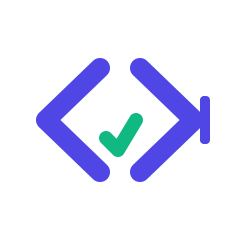

<p align="center">
  
</p>

<h1 align="center">Coding Platform</h1>

<p align="center">
  An online judge and contest platform: write code in the browser, submit it, and get it compiled,
  sandboxed, and graded against test cases in real time.
</p>

## What this is

A monorepo for a LeetCode/Codeforces-style coding platform, split into an API, a background judge
worker, a web client, and a shared package:

| Workspace          | Path              | Role                                                                 |
| ------------------- | ----------------- | --------------------------------------------------------------------- |
| `api`               | `apps/api`         | Express REST API — auth, problems, contests, submissions, test cases |
| `web`               | `apps/web`         | Next.js client — problem browser, Monaco code editor, contests, admin |
| `judge-worker`      | `workers/judge`    | BullMQ worker that compiles/runs submissions in a sandbox and grades them |
| `@coding-platform/shared` | `packages`   | Shared TypeScript types and constants used across the other workspaces |

## Features

- **Auth & profiles** — JWT-based login/register, per-user stats and badges.
- **Problems** — CRUD problem management with test cases, browsable problem list and detail pages.
- **Submissions** — submit code in multiple languages, queued and judged asynchronously, with live status.
- **Judging sandbox** — per-submission Docker-based execution with language runners for C, C++, Java,
  JavaScript, and Python, output comparison, and result classification (AC/WA/TLE/etc.), bounded by
  configurable time, memory, output, and process limits.
- **Contests** — create/manage contests, register, per-contest problem sets, live leaderboard.
- **Admin** — manage problems, users, submissions, and contests from a dedicated admin area.
- **Code editor** — Monaco-based in-browser editor with language selection and result feedback.

## Architecture

```
apps/web  →  apps/api  →  MongoDB
                 │
                 ▼
             Redis queue (BullMQ)
                 │
                 ▼
        workers/judge → Docker sandbox (per-language runners)
                 │
                 ▼
             MongoDB (submission result)
```

The API enqueues each submission onto a Redis-backed BullMQ queue; the judge worker consumes the
queue, runs the submitted code inside a sandboxed Docker executor with a per-language runner, compares
output against the problem's test cases, and writes the graded result back to MongoDB, which the web
client polls/displays.

## Tech stack

- **API**: Node.js, Express 5, Mongoose (MongoDB), BullMQ + ioredis, JWT auth, Zod validation
- **Worker**: Node.js, BullMQ, Dockerized per-language execution sandboxes
- **Web**: Next.js 16, React 19, Tailwind CSS 4, Monaco Editor
- **Shared**: TypeScript project (`@coding-platform/shared`) for types/constants shared across workspaces

## Getting started

### Prerequisites

- Node.js
- MongoDB
- Redis
- Docker (required by `workers/judge` to sandbox submitted code)

### Install

```bash
npm install
```

### Configure

Each runnable workspace reads its own `.env` (`apps/api/.env`, `apps/web/.env`, `workers/judge/.env`,
none are committed). Variables read from the source:

| Variable                | Used by                | Purpose                                  |
| ------------------------ | ----------------------- | ------------------------------------------ |
| `MONGODB_URI`            | api, worker             | MongoDB connection string                  |
| `REDIS_URL`               | api, worker             | Redis connection string for the submission queue |
| `JWT_SECRET`              | api                     | Signing secret for auth tokens             |
| `PORT`                    | api                     | API listen port                            |
| `CLIENT_URL`              | api                     | Allowed origin for CORS                    |
| `NODE_ENV`                | api, worker             | Runtime environment                        |
| `NEXT_PUBLIC_API_URL`     | web                     | Base URL the client uses to call the API   |

### Run everything

```bash
npm run dev
```

This starts the API, judge worker, and web client concurrently (`apps/api`, `workers/judge`,
`apps/web`).

### Run a single workspace

```bash
npm run dev --prefix apps/api
npm run dev --prefix apps/web
npm run dev --prefix workers/judge
```

## Project structure

```
apps/
  api/          Express API (auth, problem, contest, submission, test-case modules)
  web/          Next.js client (problems, contests, submissions, profile, admin)
workers/
  judge/        BullMQ worker, Docker sandbox, per-language runners
packages/        @coding-platform/shared — shared types and constants
docs/assets/     Logo source, motion spec, and animation recipe (see below)
```

## Logo

`docs/assets/coding-platform-logo.svg` is the canonical mark; `docs/assets/coding-platform-logo-motion.md`
and `docs/assets/coding-platform-logo-animation.mjs` define and implement a small animated variant (a
gentle checkmark pulse synced with a blinking cursor). The static PNG and animated GIF export is not yet
generated in this environment (rendering requires `rsvg-convert` and `ffmpeg`, which are not installed);
the SVG above is validated and used as the static, reduced-motion-safe fallback.

## License

ISC
